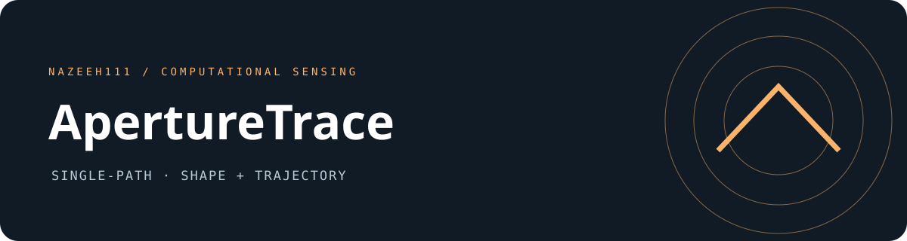
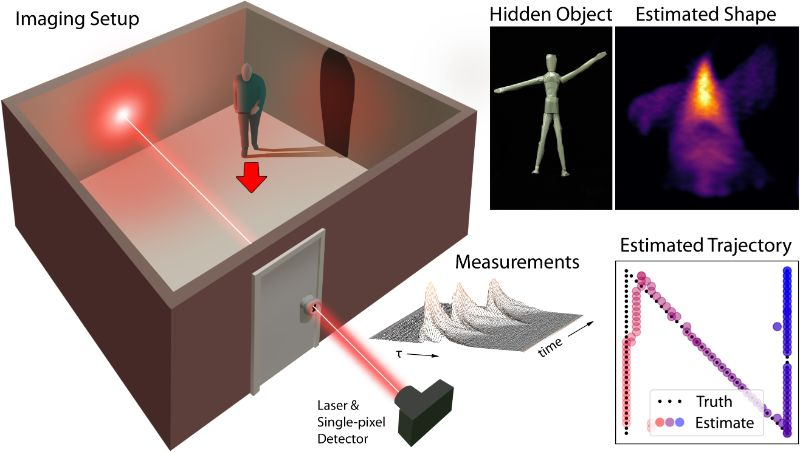

# ApertureTrace

**Development history:** Developed locally using Git before publication. These projects were published to GitHub together, so similar upload dates do not indicate when development began.



Recover hidden object shape and trajectory from transient measurements along one optical path. Captured motion changes the viewpoints used by the expectation-maximization reconstruction.



## Run

The original dependency specification is preserved in `KeyholeEnvironment.yml`. It pins a historical Python/PyTorch/CUDA stack and is not a portable modern macOS environment.

```sh
conda env create -f KeyholeEnvironment.yml
conda activate Keyhole
python Demo.py --reconstruction E
```

Choose `E`, `K`, `Y`, `Mannequin`, or `Mannequin_Assymetric`. The default remains `Mannequin_Assymetric`. Output files are written to `reconstructions/`. Review `python Demo.py --help` for unchanged reconstruction arguments.

## Compute and data

Captured `.mat` data for all five scenes is included. CPU execution is the default. The optional CUDA route is configured in the source and was designed for an NVIDIA GPU with about 10 GB memory. Full reconstruction can be compute-intensive; kernel checks do not establish end-to-end reconstruction performance.

The forward models, regularizers, learning rate, iteration schedule, coordinate conventions, file names, and scientific figure remain unchanged.

## Verification

See [verification](VERIFICATION.md) for captured-file integrity and CPU numerical checks. Physical acquisition, GPU execution, and complete reconstruction optimization are separate acceptance steps.

Maintained by **nazeeh111**.
